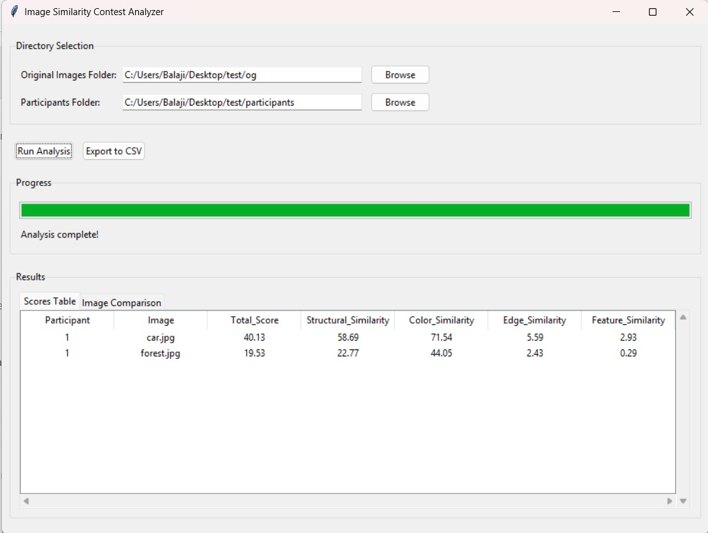
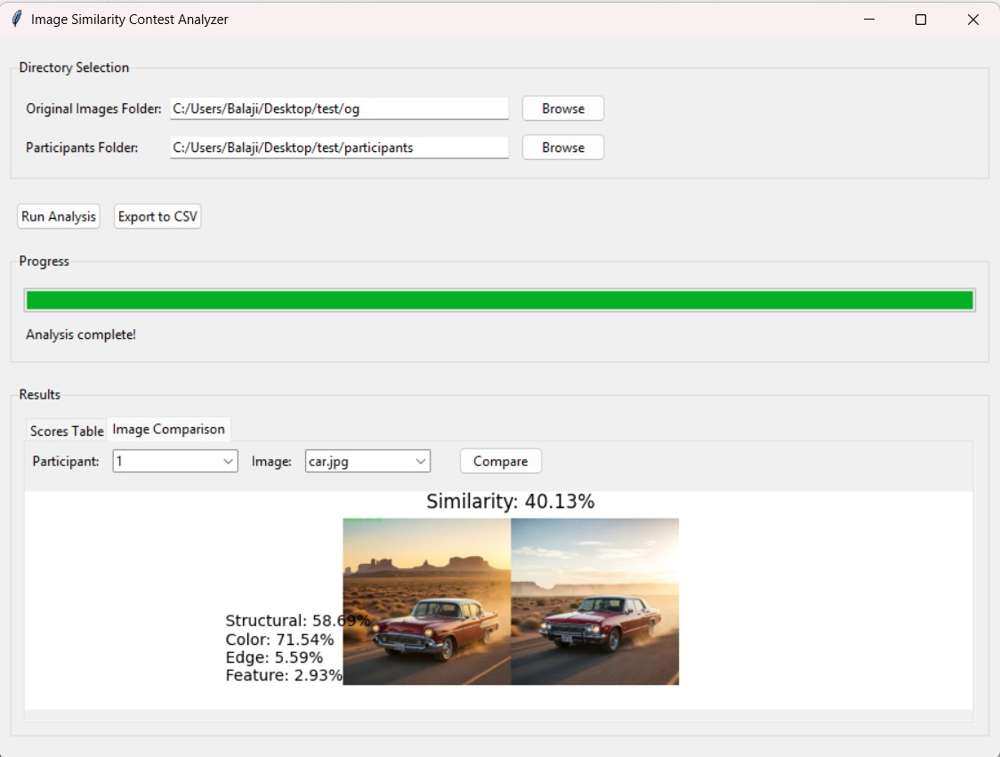

# Image Similarity Contest Analyzer

A Python application that analyzes and compares images using multiple similarity metrics for contest evaluation purposes.



## Features

- **Multiple Similarity Metrics:**
  - Structural Similarity (SSIM)
  - Color Distribution
  - Edge Detection
  - Feature Matching (SIFT)

- **User-Friendly GUI:**
  - Easy folder selection for original and participant images
  - Real-time progress tracking
  - Interactive results viewing
  - CSV export functionality

- **Visual Comparison:**
  - Side-by-side image comparison
  - Detailed similarity scores
  - Interactive participant and image selection



## Installation

1. Clone the repository:

```python
git clone https://github.com/yourusername/image-similarity-contest-analyzer.git
```

2. Install required dependencies:

```bash
pip install -r requirements.txt
```

## Dependencies

- OpenCV (cv2)
- NumPy
- Pandas
- scikit-image
- scipy
- matplotlib
- tkinter

## Usage

1. Launch the application:
```bash
python image_similarity_app.py
```

2. Select directories:
   - Choose the folder containing original images
   - Select the folder containing participant submissions
   - Each participant's images should be in their own subfolder

3. Run analysis:
   - Click "Run Analysis" to start the comparison
   - Monitor progress in real-time
   - View results in the table or comparison view

4. Export results:
   - Click "Export to CSV" to save the analysis results

## Scoring System

The application uses a weighted combination of different similarity metrics:

- Structural Similarity (35%): Overall composition and layout
- Color Similarity (25%): Color distribution and matching
- Edge Similarity (20%): Detail and shape matching
- Feature Similarity (20%): Specific element matching

Final scores range from 0 to 100, where 100 indicates perfect similarity.

## File Structure

```
participant_folder/
├── participant1/
│   ├── image1.jpg
│   ├── image2.jpg
│   └── ...
├── participant2/
│   ├── image1.jpg
│   ├── image2.jpg
│   └── ...
└── ...
```

## License

This project is licensed under the MIT License - see the LICENSE file for details.

## Contributing

1. Fork the repository
2. Create a feature branch
3. Commit your changes
4. Push to the branch
5. Create a Pull Request

## Support

For issues, questions, or contributions, please open an issue in the GitHub repository.